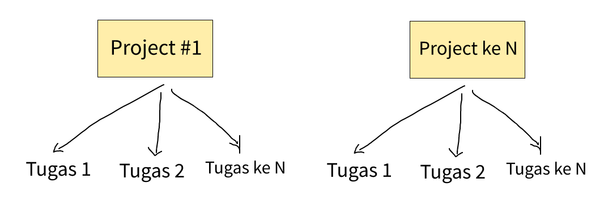

# Project Goals
Membangun aplikasi yang dapat digunakan untuk memudahkan dalam memberikan tugas dan mengelola tugas dari _Project Manager_ ke anggota. Serta memudahkan anggota untuk melihat tugas-tugas yang harus dikerjakan guna mencapai tujuan project pada kegiatan _Project Based Learning._

# Project Scope
- Project ini digunakan untuk sebagai prasarana kegiatan _Project Based Learning_ iTech Hackathon. 
- Pada early development, project ini diharapkan selesai dalam 3 - 4 hari, terhitung dari tanggal 31 Oktober 2022, dengan fokus utama pada fase pertama ini adalah pada **Software Feature** yang sempurna dengan tampilan yang sederhana. Kemudian, secara _incremental_ aplikasi dari project ini dikembang hingga menjadi lebih baik.
- Project yang akan dikembangkan merupakan aplikasi berbasis web.
- Terdapat 2 role (atau hak akses) dalam aplikasi ini, yaitu:
    - Project Manager, dengan hak akses berupa:
        - Mengelola project (Create, Read, Update & Delete)
        - Mengeola tugas project (Create, Read, Update & Delete) 
        - Membuat token registrasi anggota baru (Create)
        - _Semua fitur yang ada pada role Anggota ..._
    - Anggota
        - Melihat tugas (Read)
        - Update status tugas (Update)

# User Story (Non Standard)
- Sebagai **Project Manager**, saya ingin aplikasi tersebut dapat mengelola (CRUD) project A, project B, dst. Dari project tersebut (misalkan project A) saya ingin mengelola (CRUD) tugas project.
- Pada **Sistem**, seharusnya dapat memunculkan project-project yang telah dibuat oleh project manager beserta tugas-tugas nya kepada **Project Manager** dan **Anggota**
- Sebagai **Anggota**, saya ingin aplikasi tersebut dapat memunculkan project-project dan tugas-tugas project. Dari tugas-tugas project tersebut, **Anggota** dapat mengupdate status pekerjaan (ToDo atau Done)

Gambar 1. Hubungan project dan tugas

# Teknologi
- **Font End**
    - React JS
    - Material Design

- **Back End**
    - Firebase (untuk hosting, database NoSQL, dll)
